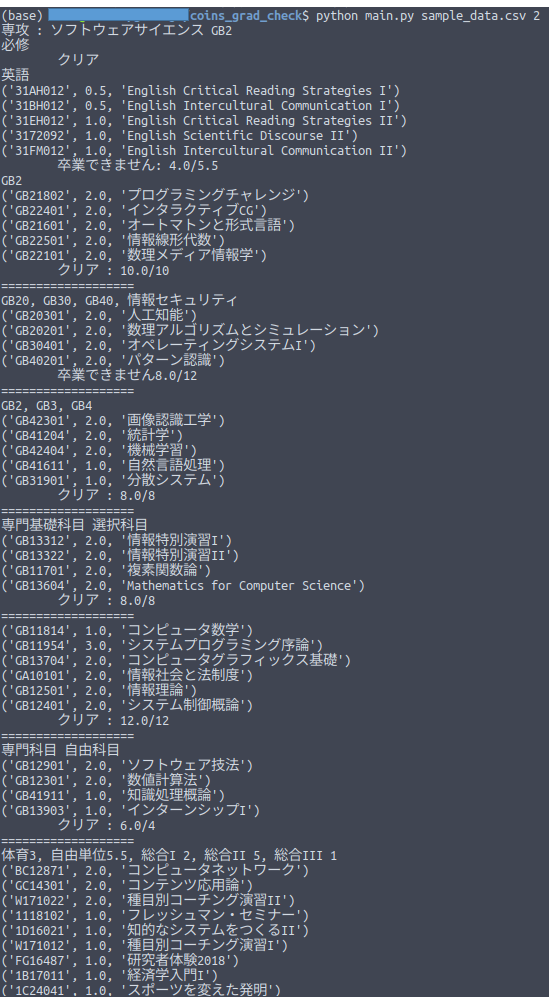

# Coinsの卒業要件に達しているかをチェック！

## abst
- 2016年入学の情報科学類生の卒業を判定をします.
- ジョークプログラムです．**このプログラムの出力を真に受けた結果，卒業できなかったとしても責任は取れません**.

- 情報科学類の卒業要件には「ある科目Aを枠1と枠2のどちらにも(どちらかに)使用できる」という仕組みが頻出します．しかしこのプログラムでは科目を雑に割り振ってしまいますので**「卒業できません」の判定を受けても組み合わせを変えれば単位が足りている場合**があります．どの科目がどの枠に割り振られたかを表示していますので細かいところは各自で入れ替えてください．

## usage
- `python main.py [csvファイル名] [専攻]` で実行
	- csvファイル : twinsにログインして「履修タブ」 -> 「科目区分参照・変更」のページからダウンロード
	- 専攻 : ソフトウェアサイエンスは2, 情報システムは3, 知能情報メディアは4を指定
- 例えば，csvを"data.csv"で保存した知能情報メディア専攻の人は $ python main.py data.csv 4

- Lazyな人たち向けに、Twinsから自動的に.csvをダウンロードしてくれるdownload_csv.pyもあります。ただし、対応するバージョンのChromeがインストールされていないと多分動きません。
	- `python download_csv.py`で実行. その後、s16xxxxxとpassを入力.
	
## misc

